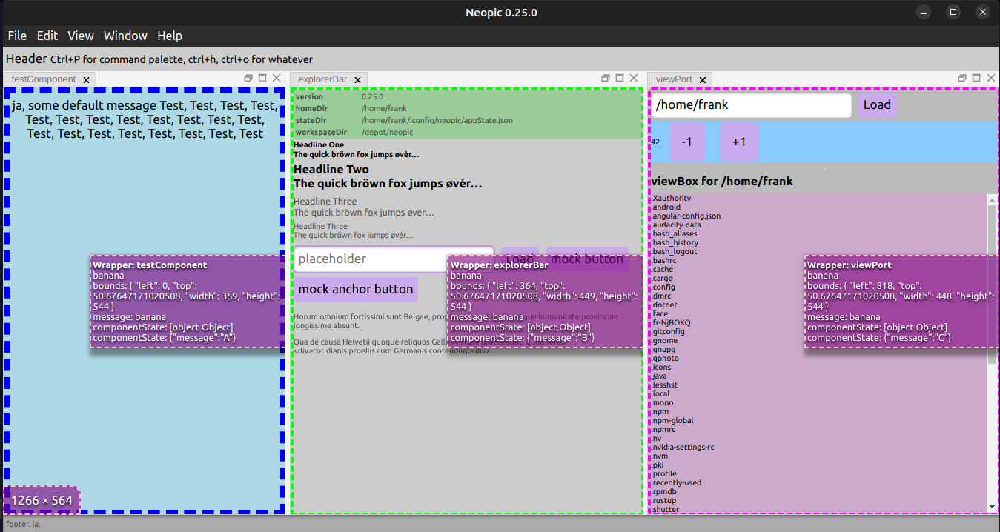

# Neopic

Neopic is an image browser with focus on organizing, tagging, captioning, sorting of images. With a special focus on families (groups) of images.

## Development

WORK IN PROGRESS clearly, but I think I already have some pretty nice groundwork.

Some structural [Development Notes](./docs/DEVELOPMENT.md)

## Tools used

I use [vscode] as my [IDE](https://code.visualstudio.com/). Some recommended extensions [here](.vscode/extensions.json). Alo note the [settings.json](.vscode/settings.json). I did work on this project on Ubuntu, Windows and Mac OS, not encountering platform specific dev issues on either

| Tools used | *perhaps you are in search of a electron forge boilderplate...* |
|-----------------|-----------------|
| electron forge    | latest version, at time of writing. starting with their template, but adding quite a bit...  |
| vite    | not webpack, yeah  |
| vitest    | didn't mind mocha or jest, but vitest turned out a lot smoother and faster  |
| typescript   |  of course  |
| ES6   | both on the main (“server”) and renderer side of life. (Required some tweaks on top level, as there are CJS-imports into node_modules. And some more tweaks to convince the test runner…)  |
| svelte | Yes, [the lean “answer”](https://svelte.dev/) to the bigger, bulkier reactive frameworks. Really looking forward to dig deeper into this... |
| sass   | Yes, sass, not scss (100% transformable ⇔ forth and back), just less semicolons and curlies in my life…  |
|  lint  | rather opionated. and, loads of auto-fixing and you guessed it, semicolon free |
| build pipeline   | I found [circleci](https://circleci.com/) to be the _( only? )_ platform to do triple-platform builds free of charge. Made builds and github releases tag-triggered rather than commit-triggered, to consume less minutes, such that the free tier suffices.  |
| shields.io | for build status badges (quite a battle) |

### Testing

I am using vitest ( [config](https://vitest.dev/config/) | [guide](https://vitest.dev/guide/) ). (much faster than mocha in this environment and a lot „cjs vs. ES6“ trouble…).

    npm run test -- test/selftest.spec.ts

    npm run test:watch -- test/selftest.spec.ts

    npm run test:debug -- test/selftest.spec.ts

### Update

    npm version minor

## testing

    npm run test

Running single tests:

    npm run test -- test/selftest.spec.ts
    npm run test:watch -- test/selftest.spec.ts
    npm run test:debug -- test/selftest.spec.ts

Tests may be in `test/` folder or in `src/` alongside application code

    npm run test -- src\main\handlers\ipcHandlers.spec.ts

## Advice on forking

If you intent to fork, you might want to use my [ci pipeline](.circleci/config.yml) and connect it to your own [circleci](https://app.circleci.com/) account, to automatically run tests and build on all three platforms \o/:

    npm run circleci

Not every commit triggers, but every push of a `circle-*` git tag. This way the free tier’s monthly allowance usually suffices, even for the more costly mac and win builds.

You might also want to a gist, that will maintain state for the latest build status (consumed by shields.io in this very README).

| env var ||
|-----------------|-----------------|
| **CIRCLE_IS_GITHUB**    | true, just because  |
| **GITHUB_GIST**	        | the hash of your 'secret' (unlisted) gist  |
| **GITHUB_TOKEN**        | ‘classic’ github authorization token (only if you plan to release)  |

Running

    npm run release

will do everything `npm run circleci` does and create a github release.

If you are fiddling with something and don't mind some open pending changes, skip the specific check against that (note: there is a space after `--`):

    npm run circleci -- nocheck
    npm run releases -- nocheck

## Acknowledgments

This project incorporates components from other open-source projects. The details of these will be found in the respective directories along with their licenses.

### Golden Layout SCSS
- **Source**: [golden-layout](https://github.com/golden-layout/golden-layout)
- **License**: MIT License (see [`src/goldenLayout/LICENSE.txt`](./src/renderer/goldenLayout/css/LICENSE) for the full license text)
- **Purpose**: easier adaption (besides using their package)

### Inspiration, and a few subroutines
- **Source**: [golden-layout-svelte](https://github.com/SillyFreak/svelte-golden-layout)
- **License**: MIT License (see  https://github.com/SillyFreak/svelte-golden-layout/blob/main/LICENSE  ) for the full license text)
- **Purpose**: Tying Svelte Components into a Golden Layout

Thanks you for your great work!

